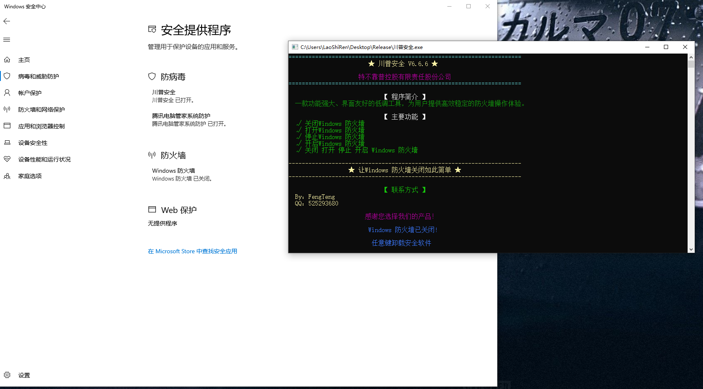

# WSC Security Product Simulator

[中文文档](./README.zh-CN.md)

## Demo

## Overview

This project demonstrates how to interact with Windows Security Center (WSC) by registering a custom security product. The solution consists of three main components that work together to register a simulated security product with WSC, potentially causing Microsoft Defender to deactivate.

## Project Components

### 1. TrustedProcessSelector

A tool designed to identify suitable processes that can be safely injected with code to register with Windows Security Center. The selector ensures that only processes that meet specific criteria are used for WSC registration.

### 2. WscIsv

A DLL designed to be injected into the target process identified by TrustedProcessSelector. It leverages COM technology to call the IWscAVStatus interface, which registers the application to the WSC product list, potentially causing Microsoft Defender to deactivate automatically.

### 3. SecurityProduct

A simulated security product that:
- Creates the target application process
- Injects the WscIsv.dll into the target process
- Provides a simple interface for controlling the registration and unregistration of the security product
- Demonstrates basic usage of the exported DLL functions

## Technical Implementation

The solution implements a minimal working example based on reverse engineering of `wscapi.dll` and `wscisvif.dll`. Communication between components is achieved through a basic shared memory segment approach.

The injection technique is inspired by the methodology described in [this blog post](https://blog.es3n1n.eu/posts/how-i-ruined-my-vacation/), which enables bypassing digital signature verification.

## Requirements

- Visual Studio 2015 or higher
- C++11 support or newer
- Windows operating system

## Limitations

This project is a proof of concept with basic functionality:
1. Not all available interfaces are implemented or utilized
2. The communication mechanism is simplified for demonstration purposes
3. This is primarily a research project to understand WSC interaction

## Disclaimer

This software is provided for educational and research purposes only. Use of this software to manipulate Windows security features may violate terms of service and could potentially expose systems to security risks. Always ensure you have appropriate permissions before using on any system.
