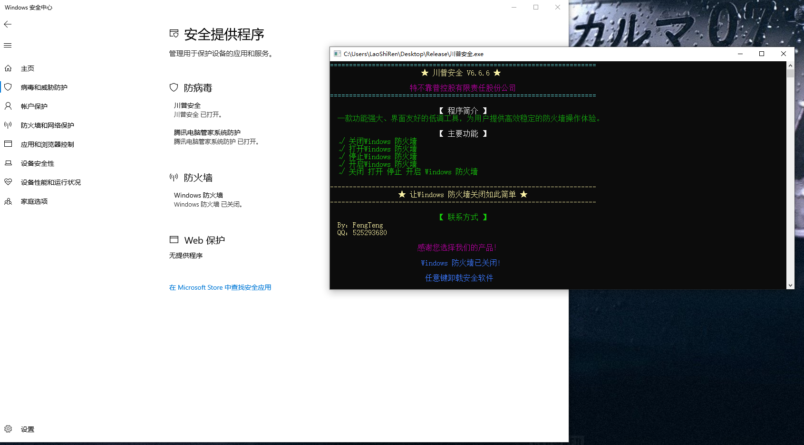

# WSC 安全产品模拟器

[English](./README.md)

## 概述

本项目演示了如何通过注册自定义安全产品与Windows安全中心(WSC)进行交互。该解决方案由三个主要组件组成，它们协同工作将模拟的安全产品注册到WSC，从而可能使Microsoft Defender自动关闭。

## 演示效果

## 项目组件

### 1. TrustedProcessSelector

一个用于识别适合的进程的工具，这些进程可以安全地注入代码以向Windows安全中心注册。选择器确保只有满足特定条件的进程才能用于WSC注册。

### 2. WscIsv

一个设计用于注入到由TrustedProcessSelector识别的目标进程的DLL。它利用COM技术调用IWscAVStatus接口，将应用程序注册到WSC产品列表中，从而可能导致Microsoft Defender自动关闭。

### 3. SecurityProduct

一个模拟的安全产品，功能包括：
- 创建目标应用程序进程
- 向目标进程注入WscIsv.dll
- 提供简单的接口用于控制安全产品的注册和卸载
- 展示DLL导出函数的基本使用方法

## 技术实现

该解决方案基于对`wscapi.dll`和`wscisvif.dll`的逆向工程，实现了最小可行的功能演示。组件间的通信通过基本的共享内存段方式实现。

注入技术参考了[这篇博客文章](https://blog.es3n1n.eu/posts/how-i-ruined-my-vacation/)中描述的方法，该方法能够绕过数字签名验证。

## 系统要求

- Visual Studio 2015或更高版本
- 支持C++11或更新标准
- Windows操作系统

## 局限性

本项目是一个概念验证，具有基本功能：
1. 并非所有可用接口都已实现或使用
2. 通信机制为演示目的而简化
3. 这主要是一个研究项目，用于理解WSC交互机制

## 免责声明

本软件仅供教育和研究目的使用。使用本软件操作Windows安全功能可能违反服务条款，并可能使系统面临安全风险。在任何系统上使用前，请确保您拥有适当的权限。

## 许可证

[在此指定您的许可证]